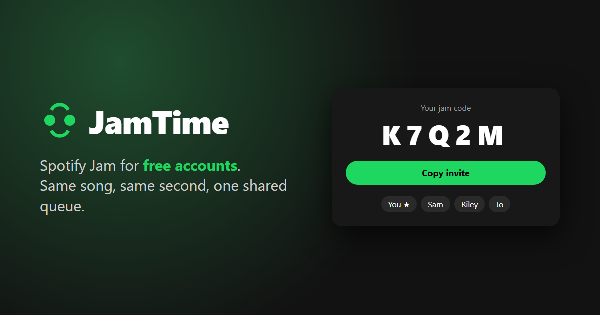

# JamTime

**Spotify Jam for free accounts.** Start a jam, send your friends the code, and everyone hears the same song at the same second, with one shared queue.



Everything happens inside Spotify. There's no server to run and no account to make, and it works between any two internet connections.

---

## Install (once)

You need the **Spotify desktop app** from [spotify.com/download](https://www.spotify.com/download). The Microsoft Store version won't work.

**Windows:** press Start, type **PowerShell**, open it, and paste:

```powershell
iwr -useb https://raw.githubusercontent.com/Psychemm/JamTime/main/install.ps1 | iex
```

**Mac / Linux:** open **Terminal** and paste:

```bash
curl -fsSL https://raw.githubusercontent.com/Psychemm/JamTime/main/install.sh | sh
```

That's it. It sets up [Spicetify](https://spicetify.app) (what lets Spotify run add-ons) if you don't have it, adds JamTime, and restarts Spotify. If Spicetify asks whether you also want the Marketplace, saying yes is fine.

> **Already use Spicetify Marketplace?** Open **Marketplace** in Spotify, search **JamTime**, and click **Install**.

## Use it

1. Click the **JamTime** button at the top of Spotify.
2. Click **Start a jam**, or type a friend's code and click **Join**.
3. Click **Copy invite** and send it to your friends.

Then just use Spotify like normal:

- **Play, pause, skip, seek or pick any song.** Everyone's Spotify follows along.
- **Add to the queue:** right-click any song → **Add to JamTime queue**. You can select several songs at once.
- **Host only:** as host, untick **Let everyone control playback** if you want to be the only one in control.

The jam ends when the host clicks **End jam** or closes Spotify, just like Spotify's own Jam.

---

## Good to know

- **Ads (free accounts):** an ad knocks you out of sync for a moment, and JamTime catches you up when it ends.
- **Songs only:** podcasts and local files aren't synced.
- **Following the jam** replaces whatever your Spotify was playing.
- **Privacy:** jam messages (song names, display names, the jam code) pass through free public relay servers, which anyone who knows or guesses a code could also read.
- **Spotify's terms:** Spicetify modifies the Spotify app, which Spotify's terms technically don't allow. Lots of people use it, but it's at your own risk.

## Troubleshooting

- **No JamTime button:** Spotify probably updated itself. Paste the install command again.
- **"No jam found with that code":** check the code, and make sure the host still has Spotify open.
- **"Could not connect":** some strict networks (schools, offices) block the relay's port. Try another network or a phone hotspot.

## Uninstall

```bash
spicetify config extensions jamtime.js-
spicetify apply
```

---

## How it works

There's no JamTime server. The host's Spotify runs the jam, and everyone swaps small messages through free public MQTT relays ([EMQX](https://www.emqx.com/en/mqtt/public-mqtt5-broker) and [Mosquitto](https://test.mosquitto.org)). The host listens on both, and each guest uses whichever relay reaches the host.

```
host Spotify ──┐                      ┌── guest Spotify
(runs the jam) ├── public MQTT relay ─┤
               │   (EMQX / Mosquitto) └── guest Spotify
```

- The **host** keeps the jam's state: current song, play/pause, position and queue. Guests sync their clocks to the host's.
- **Every Spotify**, the host's included, runs the same loop once a second. It compares its player with the jam. If you changed something yourself, the change is sent to the jam. If someone else did, or you drifted more than 2.5 s, your player follows.
- **Before any song is playing,** whatever the host plays starts the jam. When a song ends, the queue goes first. If the queue is empty, the host's Spotify autoplay keeps it going.
- Spicetify's player API is local to the app, so none of this needs Premium, unlike Spotify's Web API.

## Development

```bash
npm install
npm run build   # builds dist/jamtime.js from src/jamtime.js
npm test        # end-to-end sync test: several fake Spotifys, in-memory fake relays
```

- **`test/browser.html`:** runs two fake Spotifys with the real build over the real relays. Serve the repo over http and open it.
- **Trying changes in Spotify:** copy `dist/jamtime.js` into your Spicetify Extensions folder and run `spicetify apply`.
